# Лабораторная работа №2. Контейнеризация Docker.

**Что потребуется перед началом**:

- ПК, способный запустить систему виртуализации с виртуальной машиной GNU/Linux.

- Минимум 6 GiB свободного места на жестком диске (под систему и снапшоты).

- Пакет или установщик системы виртуализации (рекомендуется VirtualBox).

- Загруженный образ дистрибутива (рекомендуется Ubuntu 20.04).

- Результаты работы первой лабораторной.

  

**План и задачи лабораторной**:

1. Часть 1. Базовые команды Docker
   1. Подготовка рабочего окружения
   2. Образа - `docker pull`, `docker images`
   3. Метки и удаление образа - `docker tag`
   4. Запускаем контейнер - `docker run`, `docker logs`
   5. Списки контейнеров - `docker ps`
   6. Подключаемся к контейнеру - `docker exec`
   7. Список изменений - `docker diff`
   8. Завершаем контейнер -`docker stop`,  `docker kill`, `docker rm`
   9. Не теряем данные - `docker volume`
   10. Контейнер Adminer
   11. Сети - `docker network`
2. Часть 2. Продвинутая работа с Docker
   1. Настройка базы данных
   2. Запускаем Adminer
   3. Запускаем свой сервис
   4. Подробнее про сборку образа
   5. Оптимизируем сборку
   6. Многоэтапная сборка
   7. Делимся образом `docker push`


**Отчет** - в любом читаемом формате (pdf, md, doc, docx, pages).

Обязательное содержимое отчета:

0. Фамилия и инициалы студента, номер группы, номер варианта
1. План и задачи лабораторной работы
2. Краткое описание хода выполнения работы
3. Приложить очищенный вывод `history` выполненных команд


**Что нужно сделать, чтобы сдать лабораторную?**

1. Выполнить все действия, представленные в методических указаниях и ознакомиться с материалом
2. Продемонстрировать результаты выполнения преподавателю, быть готовым повторить выполнение части задач из лабораторной по требованию
3. Ответить на контрольные вопросы


## Вступление

Для полного понимания рекомендуется ознакомиться с [вводной статьей по Docker](https://docs.docker.com/get-started/overview/).


### Docker демон

Docker демон (`containerd` или `dockerd`) обслуживает Docker API запросы (через сокет или по http) и управляет Docker-объектами (образа, контейнеры, сети, тома, и т.д.). Проверить: `systemctl status dockerd`.

### Docker клиент

Docker клиент (`docker`) основной способ взаимодействия пользователя с Docker демоном (против работы напрямую с API). Когда вы запускаете команду `docker run`, клиент отправляет сообщение процессу `dockerd` (или `containerd`), который его обрабатывает. Утилита `docker` использует Docker API и может работать сразу с несколькими Docker демонами, не обязательно на локальной машине.

### Docker Desktop

Docker Desktop приложение для Mac,  Windows или Linux окружений, которое позволяет вам собирать и публиковать ваши контейнеризованные приложения и сервисы. Docker Desktop включает в себя Docker демон, Docker клиент, Docker Compose (с ним будем работать отдельно позже), Docker Content Trust, Kubernetes, и Credential Helper. Больше читайте в руководстве: [Docker Desktop](https://docs.docker.com/desktop/).

### Docker registry

Docker *registry* (реестр) хранит Docker образа. Docker Hub - публичный реестр для общего пользования, и Docker настроен искать образа там по умолчанию. Также вы можете использовать свой личный реестр.


## Часть 1.  Базовые команды Docker

### 1.1. Подготовка рабочего окружения

В предыдущей лабораторной мы уже настроили рабочее окружение в ОС Ubuntu и установили Docker. Если по каким-либо причинам вы этого еще не сделали - проделайте прямо сейчас:

[Установка Docker в Ubuntu 20.04](https://www.digitalocean.com/community/tutorials/how-to-install-and-use-docker-on-ubuntu-20-04-ru)

```bash
sudo apt install apt-transport-https ca-certificates curl software-properties-common
curl -fsSL https://download.docker.com/linux/ubuntu/gpg | sudo apt-key add -
sudo add-apt-repository "deb [arch=amd64] https://download.docker.com/linux/ubuntu focal stable"
sudo apt update
sudo apt install docker-ce
sudo systemctl status docker
```

Запустим [hello-world](https://hub.docker.com/_/hello-world):

```bash
docker run hello-world
```

После запуска контейнер отрабатывает, выводит результат работы в STDOUT и сразу завершается, т.к. основной процесс печати руководства внутри него после выполнения завершился.

Если вы хотите, чтобы ваш пользователь мог пользоваться docker без ограничений и необходимости прав суперпользователя - вы можете добавить его в группу docker:

```bash
usermod -aG docker $username
```

> Не забудьте после этого перелогиниться, чтобы процесс командного интерпретатора (в моем случае bash) запустился с новыми правами (с правами на группу docker)


### 1.2. Образа - `docker pull`, `docker images`

Для того, чтобы запустить "контейнер" нам нужна сущность под названием образ. Подробно все сущности мы разбирали на второй лекции. Остановимся на том, что это заранее упакованный слепок состояния некоторого сервиса или окружения (бибилиотеки и исполняемые файлы), которое можно использовать без дополнительных зависимостей.

Для загрузки образа используется [команда](https://docs.docker.com/engine/reference/commandline/pull/) `docker pull`, загрузим образ mysql (найти вручную подходящие образа можно на [docker hub](https://hub.docker.com/search?q=mysql)):

```bash
docker pull mysql
```

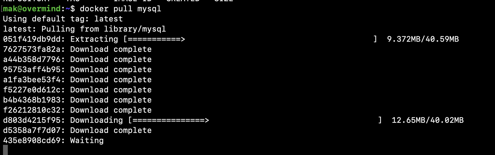

Когда загрузка и распаковка будет завершена, утилита вернет вам управление. Теперь проверим, что же мы скачали с помощью [команды](https://docs.docker.com/engine/reference/commandline/image_ls/) `docker image ls` или `docker images`:

```bash
docker image ls
docker images
```

Но что, если мы хотим скачать определенную версию образа? Нам помогут метки. Загрузим mysql версии 5.7.39:

```bash
docker pull mysql:5.7.39
```

Убедимся, что теперь у нас есть 2 образа с разными метками:

```bash
docker images
```


### 1.3. Метки и удаление образа - `docker tag`

Чтобы управлять нашими образами мы можем назначать им метки - тэги, с помощью [команды](https://docs.docker.com/engine/reference/commandline/tag/) `docker tag`:

```bash
docker tag mysql mysql:8.0-mak
```

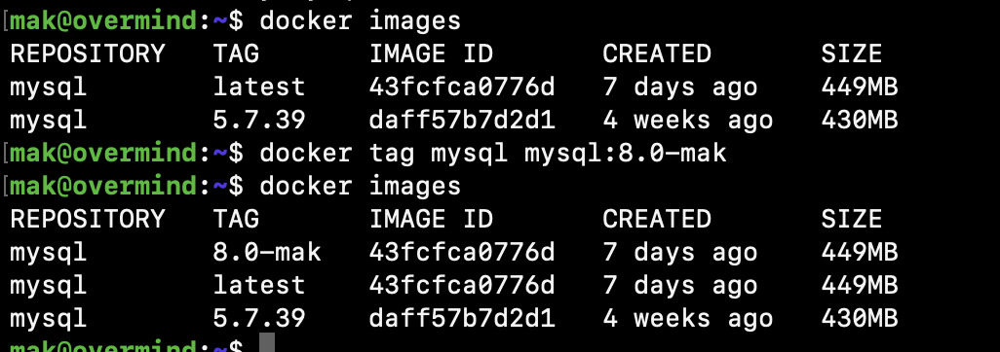

Это не создало новый образ (image ID одинаковый), но сделало еще одну ссылку на него.

Удалить образ можно удалив все ссылки на него [командой](https://docs.docker.com/engine/reference/commandline/rmi/) `docker rmi` или [аналогом](https://docs.docker.com/engine/reference/commandline/image_rm/) `docker image rm`:

```bash
docker rmi mysql:8.0-mak
docker image rm mysql:5.7.39
```

Если вы не хотите вручную выяснять, какие образа вам более не требуются воспользуйтесь [командой](https://docs.docker.com/engine/reference/commandline/image_prune/) `docker image prune`:

```bash
docker image prune
# docker image prune -a # удалить все, на которых не запущены контейнеры
```


### 1.4. Запускаем контейнер - `docker run`, `docker logs`

Запустим контейнер с СУБД [командой](https://docs.docker.com/engine/reference/commandline/run/) `docker run`:

```bash
docker run mysql
```

```
mak@overmind:~$ docker run mysql
2022-09-21 23:33:40+00:00 [Note] [Entrypoint]: Entrypoint script for MySQL Server 8.0.30-1.el8 started.
2022-09-21 23:33:40+00:00 [Note] [Entrypoint]: Switching to dedicated user 'mysql'
2022-09-21 23:33:40+00:00 [Note] [Entrypoint]: Entrypoint script for MySQL Server 8.0.30-1.el8 started.
2022-09-21 23:33:40+00:00 [ERROR] [Entrypoint]: Database is uninitialized and password option is not specified
    You need to specify one of the following:
    - MYSQL_ROOT_PASSWORD
    - MYSQL_ALLOW_EMPTY_PASSWORD
    - MYSQL_RANDOM_ROOT_PASSWORD
```

Окей, исправляемся, добавим аргумент `-e` для передачи переменной окружения, зададим пароль:

```bash
docker run -e MYSQL_ROOT_PASSWORD=password mysql
```

База запустилась, но как будто мы просто запустили ее командой mysql из консоли.

> **Задача**: поднять еще одно окно и прервать процесс контейнера, который подвесил вашу консоль без ее завершения.
> Пригодится: tmux, ps aux, kill

Теперь попробуем запустить в фоновом режиме с аргументом `-d`, кроме того, дадим ему вменяймое имя `--name $NAME`:

```bash
docker run -d -e MYSQL_ROOT_PASSWORD=password --name db1 mysql
```

Получилось, в ответ Docker выдал нам хэш-ID контейнера (далее `$ID`).

Посмотрим логи контейнера по его ID [командой](https://docs.docker.com/engine/reference/commandline/logs/) `docker logs`:

```bash
docker logs $ID
# Это можно сделать и по имени
docker logs db1
```


### 1.5. Списки контейнеров - `docker ps`

Посмотрим списки контейнеров с помощью [команды](https://docs.docker.com/engine/reference/commandline/ps/) `docker ps`:

```bash
docker ps
docker ps -a # включая завершенные
```


### 1.6. Подключаемся к работающему контейнеру - `docker exec`

Подключимся (запустим еще один процесс внутри контейнера) с помощью [команды](https://docs.docker.com/engine/reference/commandline/exec/) `docker exec`:

```bash
# i - interactive - держать STDIN открытым
# t - tty - создать псевдо-tty
docker exec -it db1 /bin/bash
```


### 1.7. Список изменений - `docker diff`

Просмотрим список изменений в слое на ФС с помощью [команды](https://docs.docker.com/engine/reference/commandline/diff/) `docker diff`:

```bash
docker diff db1
```

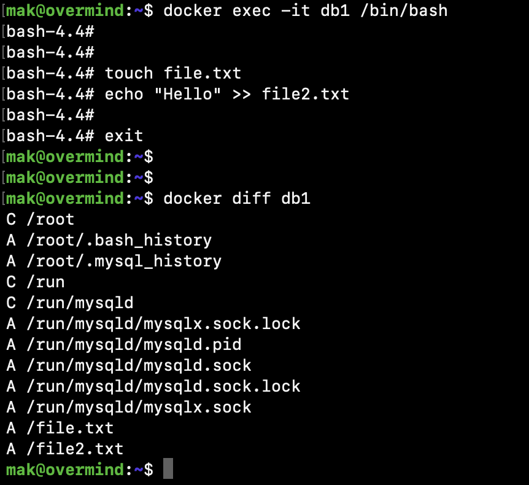

Видимо наличие новых файлов `file.txt` и `file2.txt`.


### 1.8. Завершаем контейнер - `docker stop`, `docker kill`, `docker rm`

Завершим контейнер нежно с помощью [stop](https://docs.docker.com/engine/reference/commandline/stop/), сразу завершим с помощью [kill](https://docs.docker.com/engine/reference/commandline/kill/) и удалим остатки (из спика завершенных, включая логи контейнера) c помощью [rm](https://docs.docker.com/engine/reference/commandline/rm/):

```bash
docker stop db1
docker kill db1
docker rm db1
```


### 1.9. Не теряем данные - `docker volume`

Запустим контейнер обратно:

```bash
docker run -d -e MYSQL_ROOT_PASSWORD=password --name db1 mysql
# И тут я спалил пароль в истории в открытом виде
```

> Как избежать утечки пароля через историю bash?
>
> ```bash
> # Грузите из переменных окружения из файла:
> nano .docker_mysql_rc
> # Вписываем необходимые переменные
> 
> # Передаем как переменную (если одна)
> source .docker_mysql_rc
> docker run -d -e MYSQL_ROOT_PASSWORD=${MYSQL_ROOT_PASSWORD} --name db1 mysql
> 
> # Или целиком файл (если много):
> docker run -d --env-file ./.docker_mysql_rc --name db1 mysql
> ```

Выведем содержимое файла:

```bash
docker exec -it db1 cat file2.txt
```

О ужас! Его нет. Как и всего содержимого базы. **Все данные удалились при завершении контейнера**.

Чтобы этого избежать запустим контейнер с томом:

```bash
docker run --rm -d \
	-v mysql:/var/lib/mysql \
	-v mysql_config:/etc/mysql \
	--name db1 \
	-e MYSQL_ROOT_PASSWORD=password \
	mysql
```

Внесем изменения:

```bash
docker exec -it db1 mysql -ppassword
# И тут я снова спалил пароль в истории в открытом виде
# Лучше написать -p, а дальше вводить интерактивно
# Но так как задача образовательная - пока игнорируем
```

```sql
create database testdb;
create database blog;
show schemas;
```

Завершим контейнер:

```bash
docker stop db1
```

А теперь перезапустим и убедимся, что базы testdb и blog не исчезли (как и все изменения на ФС):

```bash
docker run --rm -d \
	-v mysql:/var/lib/mysql \
	-v mysql_config:/etc/mysql \
	--name db1 \
	-e MYSQL_ROOT_PASSWORD=password \
	mysql
	
docker exec -it db1 mysql -ppassword -e "show schemas;"
```

[Просмотреть список томов](https://docs.docker.com/engine/reference/commandline/volume_ls/):

```bash
docker volume ls
```

[Создать новый](https://docs.docker.com/engine/reference/commandline/volume_create/):

```bash
docker volume create test
```

[Посмотреть информацию о томе](https://docs.docker.com/engine/reference/commandline/volume_inspect/):

```bash
docker volume inspect test
```

[Удалить том](https://docs.docker.com/engine/reference/commandline/volume_rm/):

```bash
docker volume rm test
```

[Очистить лишние тома](https://docs.docker.com/engine/reference/commandline/volume_prune/):

```bash
docker volume prune
```


### 1.10. Контейнер Adminer

Настроим дополнительный проброс портов (если кто-то настрил bridge - то просто идем на IP виртуальной машины):

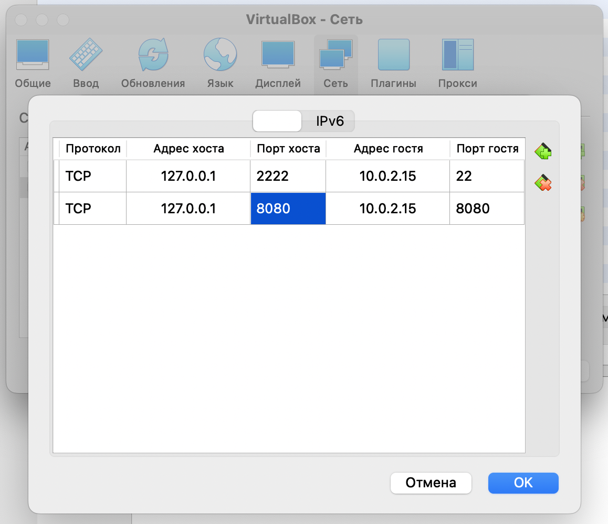

Запустим образ [Adminer](https://hub.docker.com/_/adminer) (скачается автоматически). Для того, чтобы попасть из виртуальки внутрь контейнера на порт 8080 укажем ключик `-p HostPort:ContainerPort`:

```bash
docker run -d -p 8080:8080 --name adminer adminer
```

Подключимся в браузере на хосте к `http://127.0.0.1:8080/`:

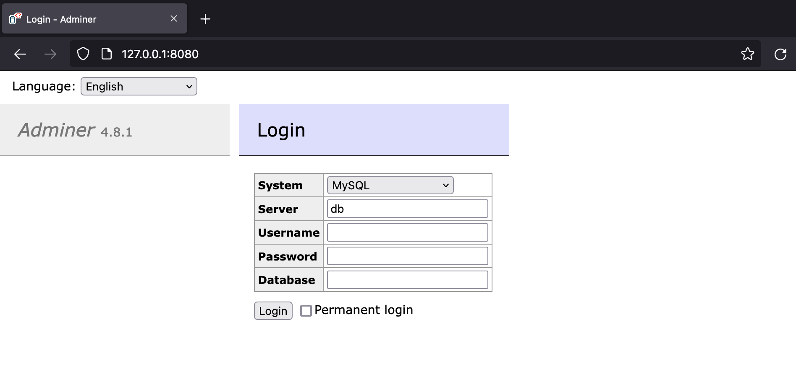

**Adminer** (бывший phpMinAdmin) — это легковесный инструмент администрирования [MySQL](https://ru.wikipedia.org/wiki/MySQL), [PostgreSQL](https://ru.wikipedia.org/wiki/PostgreSQL), [SQLite](https://ru.wikipedia.org/wiki/SQLite), [MS SQL](https://ru.wikipedia.org/wiki/MS_SQL) и [Oracle](https://ru.wikipedia.org/wiki/Oracle_(СУБД)). Проект родился как «облегчённый» вариант [phpMyAdmin](https://ru.wikipedia.org/wiki/PhpMyAdmin). Распространяется в форме одиночного [PHP](https://ru.wikipedia.org/wiki/PHP)-файла размером около 380 KB, который является результатом компиляции исходных php- и js-файлов с помощью специального PHP-скрипта. Т.о. контейнер с ним содержит php-сервер и один php-скрипт.

Однако как бы мы не пытались подключиться к базе - ничего не выйдет. Котейнеры не связаны по сети.


### 1.10. Сети - `docker network`

Для начала попробуем связать контейнеры простым способом, завершим предыдущий контейнер Adminer и запустим новый, с параметром `--link Container:AliasName`.

```bash
docker rm -f adminer
docker run -d -p 8080:8080 --link db1:mysql --name adminer adminer
```

Теперь подключимся к базе по ее `Alias` из контейнера adminer:

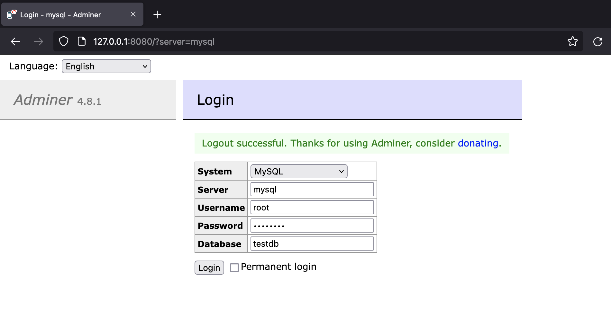

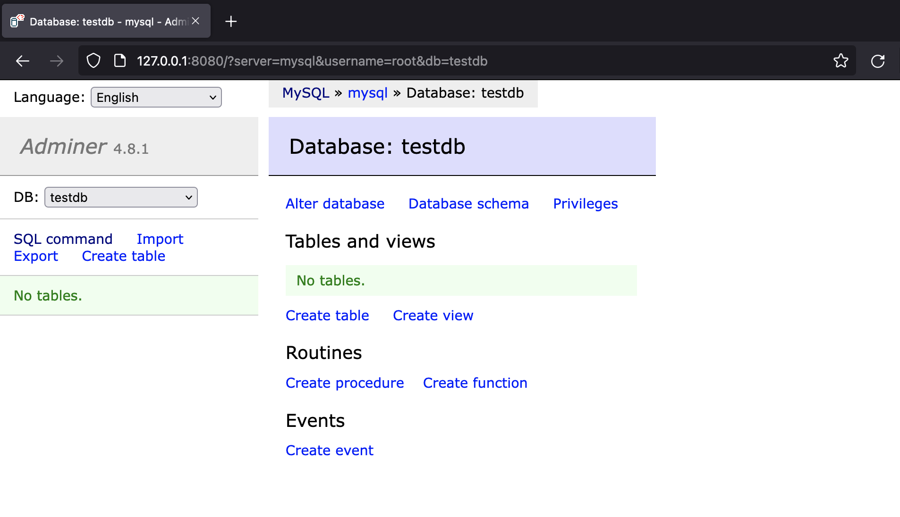

Неплохо, но такой способ считается устаревшим. К тому же, это может быть не всегда удобно. Теперь создадим новую сеть:

```bash
docker network create cluster
```

Кстати в man-странице по этой команде есть много интересного про параметры:

```bash
man docker-network-create
```

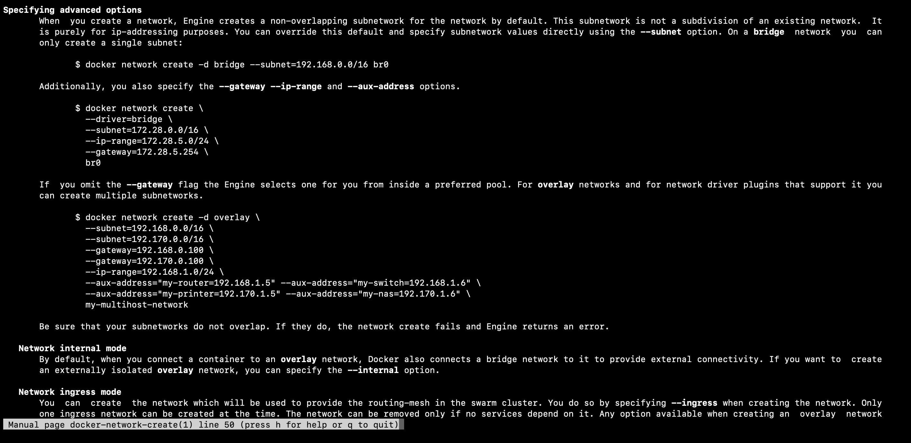

Проверим как создалась сеть с параметрами по умолчанию:

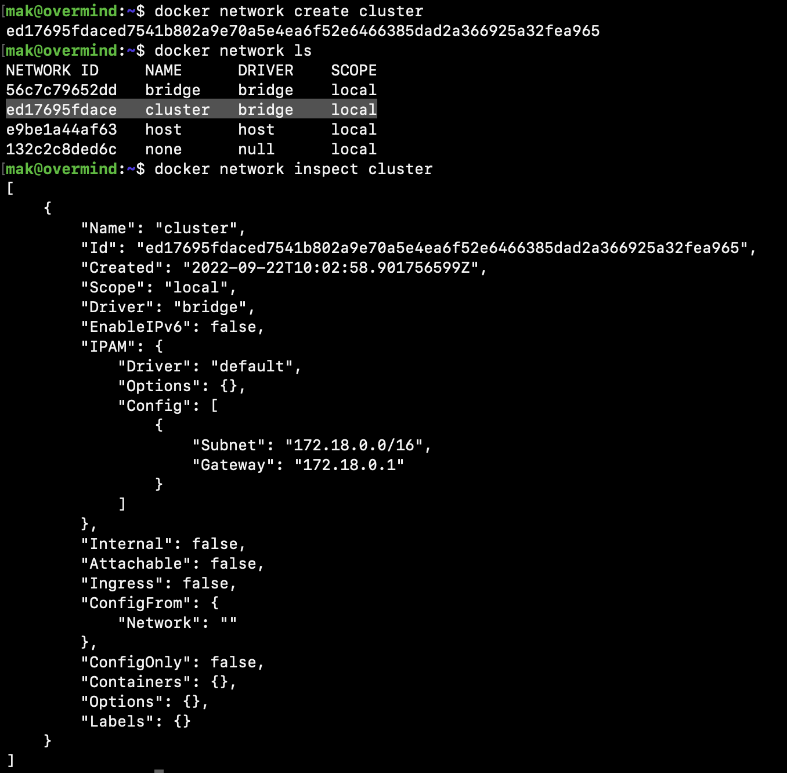

Проверим в какой сети работают сейчас Adminer и MySQL:

```bash
docker inspect db1
docker inspect adminer | egrep "IPAddress|Gateway|IPPrefixLen"
```

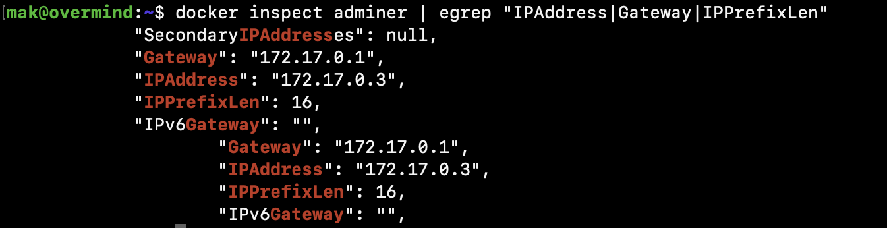

Теперь пересоздадим контейнеры СУБД и Adminer в этой сети:

```bash
docker rm -f db1
docker rm -f adminer

# Добавим к предыдущей команде запуска: --net NetName
docker run --rm -d \
	-v mysql:/var/lib/mysql \
	-v mysql_config:/etc/mysql \
	--name db1 \
	-e MYSQL_ROOT_PASSWORD=password \
	--net cluster \
	mysql

# А теперь аналогично для Adminer
docker run -d -p 8080:8080 --net cluster --name adminer adminer
```

Проверим их IP-адреса:

```bash
docker inspect db1 | egrep "IPAddress|Gateway|IPPrefixLen"
docker inspect adminer | egrep "IPAddress|Gateway|IPPrefixLen"
```

Пробуем подключиться к базе по IP-адресу:

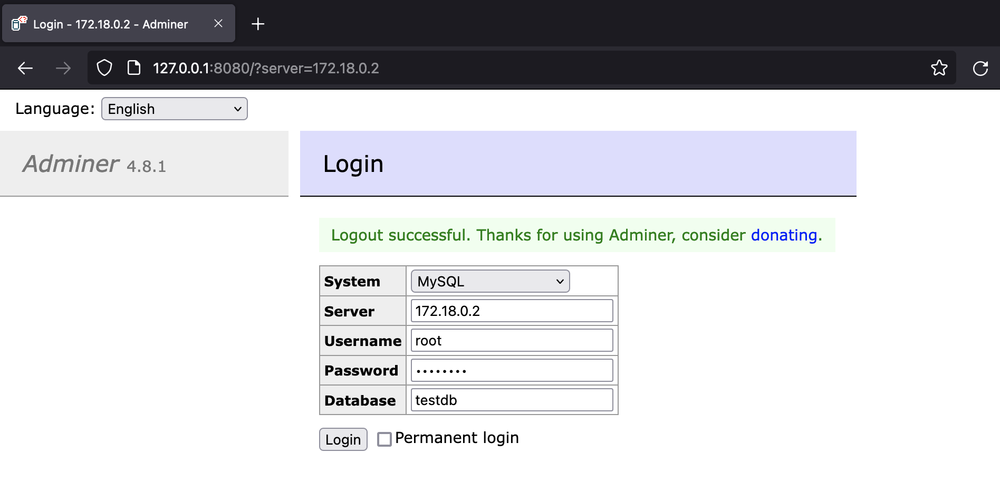

Кроме того, docker предоставляет dns-записи внутри своих сетей, поэтому мы можем обратиться по имени:

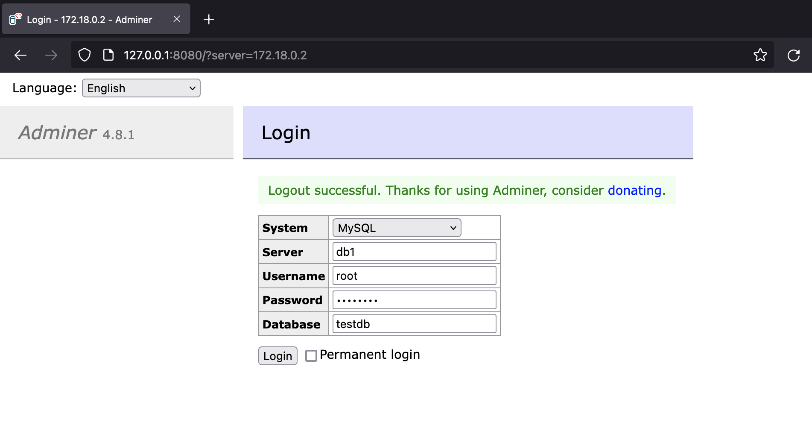

Для диагностики сетей есть [полезный образ](https://hub.docker.com/r/nicolaka/netshoot), подробное применение рассматривается по ссылке. Попробуем запустить его в интерактивном режиме и проверить сеть контейнеров с помощью `nmap`:

```
docker run -it --net cluster nicolaka/netshoot
```

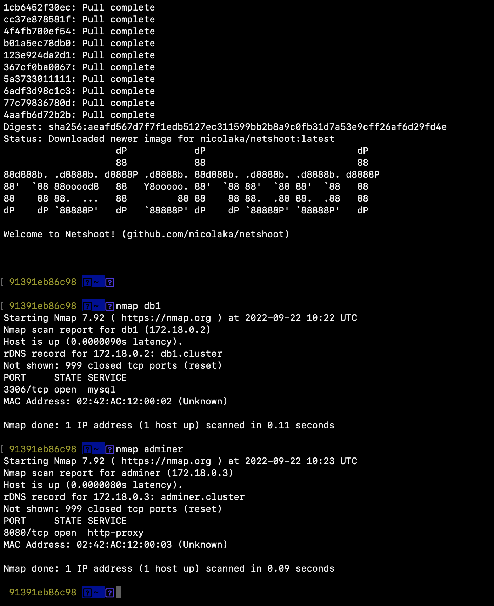

Теперь выйдем и грохнем все контейнеры:

```bash
docker stop $(docker ps -a -q)
```


## Часть 2.  Продвинутая работа с Docker

### 2.1. Настройка базы данных

```sh
docker run --rm -d \
	-v mysql:/var/lib/mysql \
	-v mysql_config:/etc/mysql \
	--name mysql \
	-e MYSQL_ROOT_PASSWORD=password \
	-e MYSQL_DATABASE=blog \
	--net cluster \
	mysql
```
Подключимся к рабочей базе и создадим таблицу
```sh
docker exec -it mysql mysql -p
# Вводим пароль из переменной MYSQL_ROOT_PASSWORD, который мы сами задали
```

Создадим табличку **posts** в базе **blog**
```sql
CREATE TABLE blog.posts (
    id INT NOT NULL AUTO_INCREMENT,
    title varchar(255),
    created TIMESTAMP DEFAULT CURRENT_TIMESTAMP,
    PRIMARY KEY (id)
);
```
Выйдем из контейнера с помощью ctrl + D


### 2.2. Запускаем Adminer

Запустим Adminer в той же сети

```sh
docker run -d -p 8080:8080 --net cluster --name adminer adminer
```
Подключимся к http://127.0.0.1:8080/ (или IP вашей ВМ, если у вас бридж-сеть).

В открывшемся интерфейсе подключимся к базе, указав:
| Поле             | Значение | Примечание            |
| ---------------- | -------- | --------------------- |
| Сервер           | mysql    | имя контейнера с СУБД |
| Имя пользователя | root     |                       |
| Пароль           | password |                       |
| База данных      | blog     |                       |

Если все прошло успешно, вы увидете нашу таблицу `posts`.
Перейдем в нее и добавим несколько записей с помощью "Новая запись".
Можно указывать только поле title, т.к. остальные поля генерятся автоматически при создании объекта.

При желании можно создасть записи и с помощью SQL через контейнер с mysql или через SQL-запрос в Adminer:
```sql
INSERT INTO blog.posts (title)
VALUES ("First Post"), ("Second Post"), ("Third Post");
```


### 2.3. Запускаем свой сервис

Загрузим себе материалы лабораторной:

```bash
git clone https://gitlab.com/tlakatlekutl/devops-lab2 && cd devops-lab2
```

В каталоге `code/` находится пример примитивного API сервиса на Golang. Для того чтобы начать с ним работать, необходимо собрать образ. Для этого воспользуемся следующей [командой](https://docs.docker.com/engine/reference/commandline/build/):

```sh
docker build -t step1 -f step1.Dockerfile code/
```
где:
- опция `-t` задает имя образа, иначе имя будет равно ID образа
- опция `-f` указывает путь к Dockerfile, если ее не указывать докет будет искать файл Dockerfile в текущем каталоге
- `code/` - это конекст для сборки образа, все файлы, которые долны быть доступны во время сборки. 

Запустим наш сервис (собранный ранее образ step1), передадим ему параметры подключения к базе через переменные окружения (с помощью опции -e), а также подключим его к контейнеру mysql.

```sh
docker run --link mysql -p 8000:8000 -e MYSQL_HOST=mysql -e MYSQL_USER=root -e MYSQL_PASSWORD=password step1
```

Проверим работу нашего приложения выполнив команду curl, в ответе должны увидеть json массив с созданными постами.
```sh
curl localhost:8000/posts
```


### 2.4. Подробнее про сборку образа

Рассмотрим структуру Dockerfile на примере `step1.Dockerfile`.

В начале любого образа должен быть указан базовый образ, на основе которого собирается новый. В нашем случае `FROM golang:1.19.1`, самый базовый возможно образ `FROM scratch`, в нем нет ничего.

`COPY` копирует файл из контекста (папочки, которою вы указываете при `docker build`) в указанное место в образе. Команда создает новый слой в образе;

`RUN` команда - запускает команду в образе, создает новый слой;

Остальные операнды либо создают пустой слой, либо напрямую меняют метаинформацию в образе.

`EXPOSE` показывает докеру, какие порты слушает приложение;
`CMD` Задает команду запуска в контейнере;
`WORKDIR` меняет рабочую директорию;
`USER` меняет пользователя, под которым идет работа;
`ENV` задает переменные окружения;
и т.д. Подробнее можно ознакомиться в [официальной документации](https://docs.docker.com/engine/reference/builder/).


Взглянем на получившиеся слои у образа:
```sh
docker history step1
```
Как было показано на лекции, каждый получившийся слой - это архив с изменнеными файлами.


### 2.5. Оптимизируем сборку

Для удобства вынесем переменные окружения в отдельный файл, например `config.env`:
```
MYSQL_DB=blog
MYSQL_HOST=mysql
MYSQL_USER=root
MYSQL_PASS=password
```

Соберем образ step2:
```sh
docker build -t step2 -f step2.Dockerfile code/
```

Запустим образ step2 и проверим, что он работает, аналогично предыдущему:
```sh
docker run --link mysql -p 8000:8000 --env-file=config.env  step2
```

> **Задание:**
> Сравните образы step1 и step2 (их Dockerfile и history) и опишите различия.


### 2.6. Многоэтапная сборка

Вы могли заметить, что для работы нашего сервиса необходим только исполняемый файл, тогда возникает вопрос "А зачем нам тащить с собой сборочные зависимости?" Да не нужны они, поэтому существует многоэтапная сборка: вы собираете исполняемый файл в отдельном образе, а затем копируете результат в эксплуатируемый образ.


Соберем, запустим и протестируем образ step3
```sh
docker build -t step3 -f step3.Dockerfile code/
docker run --link mysql -p 8000:8000 --env-file=config.env step3
```

> **Задание:**
> Взгляните на step3.Dockerfile, в чем принципиальное отличие от предыдущих докерфайлов? Оцените docker history.


### 2.7. Делимся образом - `docker push`

Для ознакомления:

```bash
# Авторизируемся где-нибудь на приватном registry
docker login

# Смотрим что за образ мы хотим загрузить
docker images

# Тэгаем
docker tag XXX:VERSION registry-gitlab.com/user_or_group/XXX:VERSION

# Загружаем
docker push registry-gitlab.com/user_or_group/XXX:VERSION
```


## Контрольные вопросы

1. Что такое и зачем нужен Docker? Альтернативные системы?
2. Как получить Docker-образ, что это такое?
3. Как запустить контейнер? Как получить доступ к его портам?
4. Как просмотреть логи контейнера?
5. Как сохранить данные внутри контейнера между его перезапусками?
6. Как подключить контейнеры к одной сети? Какие есть альтернативные варианты?
7. Почему контейнеры могут обращться между собой по имени (хэшу, если его нет)?
8. Что такое метки (docker tag)?
9. Как удалить ненужные образа и контейнеры?
10. Как запустить что-то внутри работающего контейнера?
11. Как узнать, какие файлы изменяет программа внутри контейнера?
12. Когда происходит завершение контейнера? Как сделать?
13. Перезапустите сборку собранного образа, оцените время пересборки, объясните причины.
14. К какому число слоев стремиться в образе, правила оптимизации?
15. Опишите базовые команды Dockerfile, что они делают, где смотреть документацию?
16. Что такое контекст сборки, как его оптимизировать?

