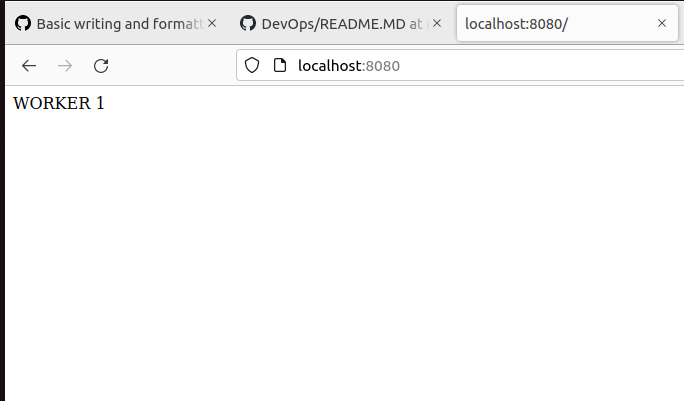

 Масштабируемость и отказоустойчивость + docker compose


## Подготовка к работе
### Установка docker-compose
```
# Если не установлена утилита curl
sudo apt install curl

sudo curl -SL https://github.com/docker/compose/releases/download/v2.12.2/docker-compose-linux-x86_64 -o /usr/local/bin/docker-compose
sudo ln -s /usr/local/bin/docker-compose /usr/bin/docker-compose
```
### Подготовка проекта
  - скачать проект [DevOps](https://github.com/iu5git/DevOps) на локальную машину: Code ->Download Zip
  
  - Разархивировать проект и зайти в папку с проектом:
```
cd DevOps-master/Лабы/Лаб3

Структура директории
├── download.png
├── haproxy-static-balancer
│   ├── docker-compose.yml
│   └── haproxy
│       └── haproxy.cfg
├── nginx-static-balancer
│   ├── docker-compose.yml
│   └── nginx
│       ├── Dockerfile
│       └── nginx.conf
├── python-ui-database
│   ├── app
│   │   ├── app.py
│   │   ├── Dockerfile
│   │   └── requirements.txt
│   ├── db
│   │   └── init.sql
│   └── docker-compose.yml
├── README.MD
├── test-compose
│   └── docker-compose.yml
└── worker
    └── Dockerfile

```
    

### Дополнительные материалы
Для выполнения лабораторной работы необходимы будут материалы лекций:
- [Docker](https://www.youtube.com/watch?v=WjRye2bByEw&list=PLLELLTvDgUQ-iwnE9coLhb-ynyZUGzW6q&index=2)
- [Docker-compose](https://www.youtube.com/watch?v=-bbxABMdHig&list=PLLELLTvDgUQ-iwnE9coLhb-ynyZUGzW6q&index=5)
## Задачи лабораторной работы
### Задание 1: Изучить работу docker-compose на примере проекта [test-compose](https://github.com/iu5git/DevOps/tree/main/Лабы/Лаб3/test-compose)
```
cd test-compose
sudo docker compose up

# Примерный результат
Attaching to test-compose-whale-1
test-compose-whale-1  |  ________ 
test-compose-whale-1  | < hello! >
test-compose-whale-1  |  -------- 
test-compose-whale-1  |     \
test-compose-whale-1  |      \
test-compose-whale-1  |       \     
test-compose-whale-1  |                     ##        .            
test-compose-whale-1  |               ## ## ##       ==            
test-compose-whale-1  |            ## ## ## ##      ===            
test-compose-whale-1  |        /""""""""""""""""___/ ===        
test-compose-whale-1  |   ~~~ {~~ ~~~~ ~~~ ~~~~ ~~ ~ /  ===- ~~~   
test-compose-whale-1  |        \______ o          __/            
test-compose-whale-1  |         \    \        __/             
test-compose-whale-1  |           \____\______/   
test-compose-whale-1 exited with code 0

```
**Задача**: Заменить надпись на свое имя, запустить контейнер, продемонстрирать результат 
Для замены надписи необходимо открыть файл docker-compose.yml в папке test-compose в редакторе nano
```
nano docker-compose.yml
```
Необходимо:
- Заменить словов строке: 'command: ["cowsay", "hello!"]'
- Сохранить изменения (Ctrl+O, Ctrl+X)
- Заново стартовать контейнер
- Зафиксировать результат для отчета

### Задание 2: Изучить методы балансировки нагрузки между узлами кластера. 

Изучить структуру проектов: [Ha proxy balancer](https://github.com/iu5git/DevOps/tree/main/Лабы/Лаб3/haproxy-static-balancer))
 
```
cd ../haproxy-static-balancer
.
├── docker-compose.yml 
└── haproxy
    └── haproxy.cfg
```

**docker-compose.yml** 
```
version: '3'

services:
  worker1:
    build: # собираем образ воркера наосновании контейнера с nginx.Контейнер отдает нам статическую страницу с значением WORKER_ID 
      context: ../worker
      dockerfile: Dockerfile
      args:
        - WORKER_ID=1  # Аргумент, который мы передаем в контейнер
    expose:
        - 80 # Порт, по которому запущен nginx внутри контейнера
  worker2:
    build:
      context: ../worker
      dockerfile: Dockerfile
      args:
        - WORKER_ID=2
    expose:
        - 80 # Порт, по которому запущен nginx внутри контейнера
  haproxy:
    image: haproxy
    volumes:
        - ./haproxy:/usr/local/etc/haproxy # путь к файлу конфигурации haproxy
    links: # Связываем воркеры и балансировщик. ВАЖНО- имена контейнеров воркеров нам пригодятся длянастройки балансировки
        - worker1
        - worker2
    ports:
        - "8080:80"  # Преобразование внешнего порта, входная точка балансировки в контейнер балансировки по порту 8080 
    expose:
        - 80   # haproxy Внешние порты для контейнеров, по кторым будет идти балансировка
```

**haproxy.cfg**
```
defaults
    log global # Пишем в лог все события
    mode http # Какой тип проксирования трафика - http, tcp
    timeout connect 5000ms # настройки времени соединений
    timeout client 50000ms
    timeout server 50000ms
    stats uri /status # проверка статуса соединенияпо этому адреcу
frontend balancer
    bind 0.0.0.0:80 # балансировщик будет принимать соединения с локальной машины по этому порту от клиента
    default_backend web_backends
backend web_backends # Настраиваем куда балансировщик будет перенаправлять входящие запросы- это два наших воркер контейнера по порту 80
    balance roundrobin # Метод балансировки, см. материалы лекции
    server web1 worker1:80
    server web2 worker2:80
```

**../worker/Dockerfile**
```
FROM nginx:alpine

ARG WORKER_ID # Аргумент, передаваемый в докер файл снаружи при построении

RUN echo "WORKER $WORKER_ID" > /usr/share/nginx/html/index.html # Записываем его в статическую страницу для веб-вервера

EXPOSE 80
```

Запустить контейнеры:
```
pwd
DevOps-master/Лабы/Лаб3/haproxy-static-balancer
# Убедились что мы в нужной папке

sudo docker-compose up
```
Пример вывода:
```
Running 4/4
 ⠿ Network haproxy-static-balancer_default      Created                                                                                                                         1.3s
 ⠿ Container haproxy-static-balancer-worker2-1  Created                                                                                                                         2.8s
 ⠿ Container haproxy-static-balancer-worker1-1  Created                                                                                                                         2.9s
 ⠿ Container haproxy-static-balancer-haproxy-1  Created                                                                                                                         0.8s
Attaching to haproxy-static-balancer-haproxy-1, haproxy-static-balancer-worker1-1, haproxy-static-balancer-worker2-1
haproxy-static-balancer-worker1-1  | /docker-entrypoint.sh: /docker-entrypoint.d/ is not empty, will attempt to perform configuration
haproxy-static-balancer-worker1-1  | /docker-entrypoint.sh: Looking for shell scripts in /docker-entrypoint.d/
haproxy-static-balancer-worker1-1  | /docker-entrypoint.sh: Launching /docker-entrypoint.d/10-listen-on-ipv6-by-default.sh
haproxy-static-balancer-worker2-1  | /docker-entrypoint.sh: /docker-entrypoint.d/ is not empty, will attempt to perform configuration
haproxy-static-balancer-worker2-1  | /docker-entrypoint.sh: Looking for shell scripts in /docker-entrypoint.d/
haproxy-static-balancer-worker2-1  | /docker-entrypoint.sh: Launching /docker-entrypoint.d/10-listen-on-ipv6-by-default.sh
haproxy-static-balancer-worker2-1  | 10-listen-on-ipv6-by-default.sh: info: Getting the checksum of /etc/nginx/conf.d/default.conf
haproxy-static-balancer-worker1-1  | 10-listen-on-ipv6-by-default.sh: info: Getting the checksum of /etc/nginx/conf.d/default.conf
haproxy-static-balancer-worker1-1  | 10-listen-on-ipv6-by-default.sh: info: Enabled listen on IPv6 in /etc/nginx/conf.d/default.conf
haproxy-static-balancer-worker1-1  | /docker-entrypoint.sh: Launching /docker-entrypoint.d/20-envsubst-on-templates.sh
haproxy-static-balancer-worker2-1  | 10-listen-on-ipv6-by-default.sh: info: Enabled listen on IPv6 in /etc/nginx/conf.d/default.conf
haproxy-static-balancer-worker2-1  | /docker-entrypoint.sh: Launching /docker-entrypoint.d/20-envsubst-on-templates.sh
haproxy-static-balancer-worker2-1  | /docker-entrypoint.sh: Launching /docker-entrypoint.d/30-tune-worker-processes.sh
haproxy-static-balancer-worker1-1  | /docker-entrypoint.sh: Launching /docker-entrypoint.d/30-tune-worker-processes.sh
haproxy-static-balancer-worker1-1  | /docker-entrypoint.sh: Configuration complete; ready for start up
haproxy-static-balancer-worker2-1  | /docker-entrypoint.sh: Configuration complete; ready for start up
haproxy-static-balancer-worker1-1  | 2022/10/26 20:31:12 [notice] 1#1: using the "epoll" event method
haproxy-static-balancer-worker1-1  | 2022/10/26 20:31:12 [notice] 1#1: nginx/1.23.2
haproxy-static-balancer-worker1-1  | 2022/10/26 20:31:12 [notice] 1#1: built by gcc 11.2.1 20220219 (Alpine 11.2.1_git20220219) 
haproxy-static-balancer-worker1-1  | 2022/10/26 20:31:12 [notice] 1#1: OS: Linux 5.15.0-52-generic
haproxy-static-balancer-worker1-1  | 2022/10/26 20:31:12 [notice] 1#1: getrlimit(RLIMIT_NOFILE): 1048576:1048576
haproxy-static-balancer-worker1-1  | 2022/10/26 20:31:12 [notice] 1#1: start worker processes
haproxy-static-balancer-worker1-1  | 2022/10/26 20:31:12 [notice] 1#1: start worker process 30
haproxy-static-balancer-worker1-1  | 2022/10/26 20:31:12 [notice] 1#1: start worker process 31
haproxy-static-balancer-worker1-1  | 2022/10/26 20:31:12 [notice] 1#1: start worker process 32
haproxy-static-balancer-worker1-1  | 2022/10/26 20:31:12 [notice] 1#1: start worker process 33
haproxy-static-balancer-worker2-1  | 2022/10/26 20:31:12 [notice] 1#1: using the "epoll" event method
haproxy-static-balancer-worker2-1  | 2022/10/26 20:31:12 [notice] 1#1: nginx/1.23.2
haproxy-static-balancer-worker2-1  | 2022/10/26 20:31:12 [notice] 1#1: built by gcc 11.2.1 20220219 (Alpine 11.2.1_git20220219) 
haproxy-static-balancer-worker2-1  | 2022/10/26 20:31:12 [notice] 1#1: OS: Linux 5.15.0-52-generic
haproxy-static-balancer-worker2-1  | 2022/10/26 20:31:12 [notice] 1#1: getrlimit(RLIMIT_NOFILE): 1048576:1048576
haproxy-static-balancer-worker2-1  | 2022/10/26 20:31:12 [notice] 1#1: start worker processes
haproxy-static-balancer-worker2-1  | 2022/10/26 20:31:12 [notice] 1#1: start worker process 31
haproxy-static-balancer-worker2-1  | 2022/10/26 20:31:12 [notice] 1#1: start worker process 32
haproxy-static-balancer-worker2-1  | 2022/10/26 20:31:12 [notice] 1#1: start worker process 33
haproxy-static-balancer-worker2-1  | 2022/10/26 20:31:12 [notice] 1#1: start worker process 34
haproxy-static-balancer-haproxy-1  | [NOTICE]   (1) : New worker (8) forked
haproxy-static-balancer-haproxy-1  | [NOTICE]   (1) : Loading success.

```
Зайти в окно браузера и набрать: [localhost:8080](localhost:8080)


**Задача**: Собрать статистику на 10 запросах для разных методов балансировки и объяснить результаты: 
   1. RoundRobin
   2. RoundRobin с добавлением веса
   3. LeastConnection 
   4. LeastConnection с добавлением веса
   5. (Дополнительно) Самостоятельно изучить балансировку контейнеров с использованием nginx, попробовать те же методы балансировки [nginx-balancer](https://github.com/iu5git/DevOps/tree/main/Лабы/Лаб3/nginx-static-balancer 
   6. (Дополнительно) Написать скрипт сбора статистики на 1000 запросах для получения блее четких данных распределения

### Задание 3: Многокомпонентый проект docker-compose 
   1. Изучить структуру проекта [сервис-база данных приложения развернутого в кластере из двух контейнеров](https://github.com/iu5git/DevOps/tree/main/Лабы/Лаб3/python-ui-database)
   2. Добавить запись в базу используя встроенный контейнер phpmyadmin
   3. (Дополнительно) Добавить запись в базу используя внешний клиент, например [Datagrip](https://www.jetbrains.com/datagrip/).
   4. Добавить в проект еще один сервис app (по аналогии с заданием 2), добавить балансировщик нагрузки для сервисов app, испльзуя либо контейнер nginx либо haproxy

*Формат отчета:*
- Doc-документ
- Скриншоты результатов заданий и ответ на вопрос задания
- Отчеты присылать на [Яндекс-форму](https://forms.yandex.ru/u/63428b48921ce71d986818ef/)

*Контрольные вопросы:*
- Какие способы организации работы с сетью есть в Docker?
- Как определяются списки в стандарте YAML?
- При "пробросе" портов контейнера docker-compose что стоит на первом месте- порт хоста или порт контейнера?
- Какой метод балансировки нагрузки в каком случае используется?
