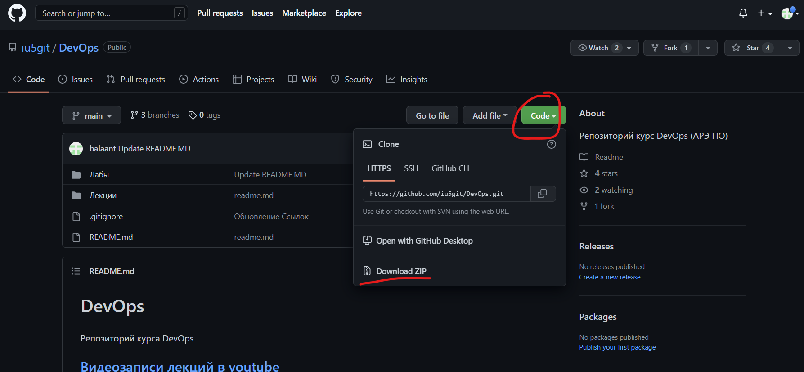
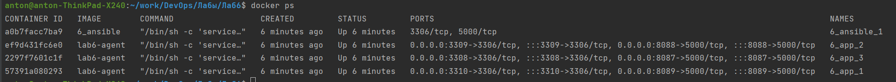

# Ansible, Playbook

## Подготовка к работе

- Работа в операционной системе семейства Linux
- Устанвленные Docker,Docker-compose
- Установленный пакет Python3

### Дополнительные материалы
Для выполнения лабораторной работы необходимы будут материалы лекций:
- [Docker](https://www.youtube.com/watch?v=WjRye2bByEw&list=PLLELLTvDgUQ-iwnE9coLhb-ynyZUGzW6q&index=2)
- [Docker-compose](https://www.youtube.com/watch?v=-bbxABMdHig&list=PLLELLTvDgUQ-iwnE9coLhb-ynyZUGzW6q&index=5)
- [Ansible](https://www.youtube.com/watch?v=59HZ6R6nYQ4&list=PLLELLTvDgUQ-iwnE9coLhb-ynyZUGzW6q&index=6)

### Подготовка проекта
  - скачать проект [DevOps](https://github.com/iu5git/DevOps) на локальную машину: Code ->Download Zip
  
  - Разархивировать проект и зайти в папку с проектом:
```
cd DevOps-master/Лабы/Лаб6
Структура директории
├── ansible
│   ├── ansible.cfg
│   ├── Dockerfile
│   ├── inventory
│   │   ├── all_vars
│   │   ├── ansible_master_vars
│   │   ├── application_vars
│   │   ├── database_vars
│   │   └── workers
│   └── playbooks
│       ├── app
│       │   ├── app.py
│       │   ├── env.j2
│       │   └── requirements.txt
│       ├── mysql
│       │   ├── dump.sql
│       │   ├── permissions.sql
│       │   └── root_cnf.j2
│       ├── nginx
│       │   └── nginx.conf.j2
│       ├── playbook-application.yml
│       └── playbook-database.yml
├── docker-compose.yml
├── download.png
├── lab6-agent
│   ├── build.sh
│   └── Dockerfile
└── README.MD

```

### Установка lab6-agent и проверка тестрового стенда
```
cd  lab6-agent
# собираем образ базового контейнера для лабы
./build.sh

# поднимаем тестовый стенд

cd ../
docker-compose up -d
#после успешной компиляции образов и старта кластера
docker-compose down
```


## Задачи лабораторной работы
### Задание 1: Поднять кластер и установить тестовую базу данных

Поднимаем тестовый стенд
```
# ссылка для информации https://karthi-net.medium.com/how-to-scale-services-using-docker-compose-31d7b83a6648
docker-compose up -d --scale app=3
```

Делаем листинг запущенных контейнеров
```
docker ps
```

Находим контейнер 6-ansible-1 или 6_ansible_1 (в разных реализациях docker-compose бывает по разному)
**Важно! Необходимо заменить в [инвентори файле](ansible/inventory/workers) на _ или - в зависимости от названия в системе**

Заходим на хост с ансиблем
```
docker exec -it `docker ps -aqf "name=6-ansible-1"` bash
#или
docker exec -it `docker ps -aqf "name=6_ansible_1"` bash
```
**Ad-hoc команды**
Ad-hoc - вызов отдельных команд.
Ping - проверяем доступность хостов инвернтори
```
ansible all -m ping
```
Пример вывода
```
6-app-2 | SUCCESS => {
    "ansible_facts": {
        "discovered_interpreter_python": "/usr/bin/python3"
    },
    "changed": false,
    "ping": "pong"
}
6-app-3 | SUCCESS => {
    "ansible_facts": {
        "discovered_interpreter_python": "/usr/bin/python3"
    },
    "changed": false,
    "ping": "pong"
}
6-app-1 | SUCCESS => {
    "ansible_facts": {
        "discovered_interpreter_python": "/usr/bin/python3"
    },
    "changed": false,
    "ping": "pong"
}
```
Команда uptime- проверяем сколько времени поднят сервер
```
ansible all -m command -a 'uptime'
```
Пример вывода
```
6-app-2 | CHANGED | rc=0 >>
19:08:47 up 1 day,  4:18,  1 user,  load average: 1.39, 1.14, 1.22
6-app-1 | CHANGED | rc=0 >>
19:08:47 up 1 day,  4:18,  1 user,  load average: 1.39, 1.14, 1.22
6-app-3 | CHANGED | rc=0 >>
19:08:47 up 1 day,  4:18,  1 user,  load average: 1.39, 1.14, 1.22
```

Запускаем [плейбук для установки базы](ansible/playbooks/playbook-database.yml):
```
ansible-playbook /playbooks/playbook-database.yml
```
Плейбук поставит и установит базу на хост 6_app_3.

Проверяем
заходим на хост с базой (из масер-хоста ansible: 6_ansible_1)
```
ssh 6_app_3
```
На хосте заходим в клиент базы mysql
```
mysql
```
выбираем созданную базу testdb
```
mysql> use testdb

## пример вывода: 
Reading table information for completion of table and column names
You can turn off this feature to get a quicker startup with -A

Database changed
```
Сделаем селект из тестовой таблицы
```
mysql> select * from test;

# при
+--------------------+
| message            |
+--------------------+
| Ansible To Do List |
| Get ready          |
| Ansible is fun     |
+--------------------+
3 rows in set (0.00 sec)

```

# Задание 2: Подготовить работу приложений
Запускаем [плейбук для установки приложений](ansible/playbooks/playbook-application.yml) :
```
ansible-playbook /playbooks/playbook-application.yml
```

Проверим что процесс работает на хосте
```
ssh 6_app_1
# После логина найдем что процесс запущен
ps ax | grep python 
# И убедимся что порт 5000 открыт
netstat -nlp | grep 5000
```

Для проверки, что приложение запущено на всех хостах и чтобы не проверять по одному, воспользуемся adhoc командой. 
C помощью утилиты curl проверим работу сервиса и загрузку данных из базы для всех нод
```
ansible application -a "curl localhost:5000" -m shell
```

### Задание 3: Установить балансировщик нагрузки nginx используя ad-hoc команды
поставим необходимвй пакет nginx, давайте установим его без плейбука
```
ansible ansible_master -a "name=nginx update_cache=yes cache_valid_time=3600 state=present" -m apt
```
Скопируем шаблон конфигурационного файла nginx, поставив в него хосты наших приложений, используется шаблизатор [jinja](https://jinja.palletsprojects.com/en/3.0.x/templates/)
```
ansible ansible_master -a "src=playbooks/nginx/nginx.conf.j2 dest=/etc/nginx/nginx.conf owner=root" -m template
```
и запустим nginx из консоли на хосте 6_ansible_1:
```
nginx
```
проверим работу nginx вызвав с нашей хост машины: [localhost:8080](localhost:8080)

### Задание 4: Добавить еще один экземпляр 6_app_3
Добавить еще один экземпляр, прописав изменения во всех необходимых файлах.

## Формат отчета
- Doc-документ
- Скриншоты результатов заданий и ответы на вопросы задания
- Отчеты присылать на [Яндекс-форму](https://forms.yandex.ru/u/63428b48921ce71d986818ef/)

## Контрольные вопросы
